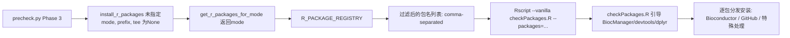

## 用户需求

合并 `prnaseqtools/auto_install.py` 与 `scripts/checkPackages.R` 中重复的 R 包安装逻辑，消除两个文件中各自硬编码的 R 包列表。

## 产品概述

建立以 Python 注册表为单一数据源、R 脚本接受参数化调用的统一 R 包安装机制。

## 核心功能

- Python 注册表（`R_PACKAGE_REGISTRY`）作为 R 包定义的唯一真实来源，包含包名、安装源（Bioconductor/GitHub）和 mode 过滤规则
- 按分析模式（mode）过滤 R 包，避免无关模式安装不必要的包（如 ORFik 仅在 cips 模式下安装）
- `checkPackages.R` 接受 `--packages` 命令行参数，根据 Python 传入的包名列表按需安装
- 无参数调用时保持向后兼容，安装全部 R 包
- R 脚本保留 BiocManager/devtools/dplyr 自动引导、NMF devel 分支版本检测、Seurat 捆绑 uwot 等 R 侧特有逻辑

## 技术栈

- Python 3：注册表定义、mode 过滤、subprocess 调用
- R：BiocManager / devtools / remotes 包安装，命令行参数解析

## 实现方案

### 整体策略

采用"Python 驱动 + R 增强"架构：

1. Python 侧新增 `R_PACKAGE_REGISTRY` 独立注册表，定义所有 R 包元数据（安装源、GitHub 仓库、mode 过滤等）
2. Python 侧新增 `get_r_packages_for_mode(mode)` 按 mode 过滤并返回包名列表
3. 重写 `install_r_packages(prefix, mode=None, tee=None)` 将过滤后的包名列表通过 `--packages` 参数传给 R 脚本
4. R 脚本内部维护安装动作分发表，接收包名列表后逐包安装
5. 从 `DEPENDENCY_REGISTRY` 中删除所有 `R::*` 死条目

### 数据流



### R_PACKAGE_REGISTRY 结构设计

每个条目包含：

| 字段 | 类型 | 说明 |
| --- | --- | --- |
| `pkg` | str | R 包名 |
| `source` | str | `bioconductor` / `github` |
| `github_repo` | str | GitHub 仓库路径（source=github 时必填） |
| `github_ref` | str | 可选分支名（如 NMF 的 `devel`） |
| `mode_only` | list | 可选，限定分析模式 |
| `install_msg` | str | 安装提示信息 |
| `extra` | list | 可选，额外需要安装的包名 |


### R 脚本命令行接口

```
# 无参数：安装全部 R 包（向后兼容）
Rscript checkPackages.R

# 指定包列表：仅安装传入的包
Rscript checkPackages.R --packages DESeq2,pheatmap,NMF
```

R 脚本内部使用 `commandArgs(trailingOnly=TRUE)` 解析参数。每个包的安装动作通过内部 dispatch 查找表确定：

- Bioconductor 包 → `BiocManager::install()`
- GitHub 包 → `devtools::install_github(repo, ref=ref)`
- 特殊包（Seurat/NMF）→ 自定义安装逻辑（含版本检查和捆绑安装）

### 性能考量

- `get_r_packages_for_mode()` 为 O(n) 过滤，n 为注册表条目数（8-10），无性能瓶颈
- R 脚本逐包安装，与原有行为一致，无新增网络开销
- mode 过滤可显著减少非必要模式的安装时间（如 clip 模式不再安装 riboWaltz 等）

### 向后兼容

- 无参数调用 `Rscript checkPackages.R` 行为不变（安装全部）
- `precheck.py` Phase 3 新增 mode 参数，但函数签名保持不变
- README 中 `Rscript scripts/checkPackages.R` 手动调用方式仍然有效