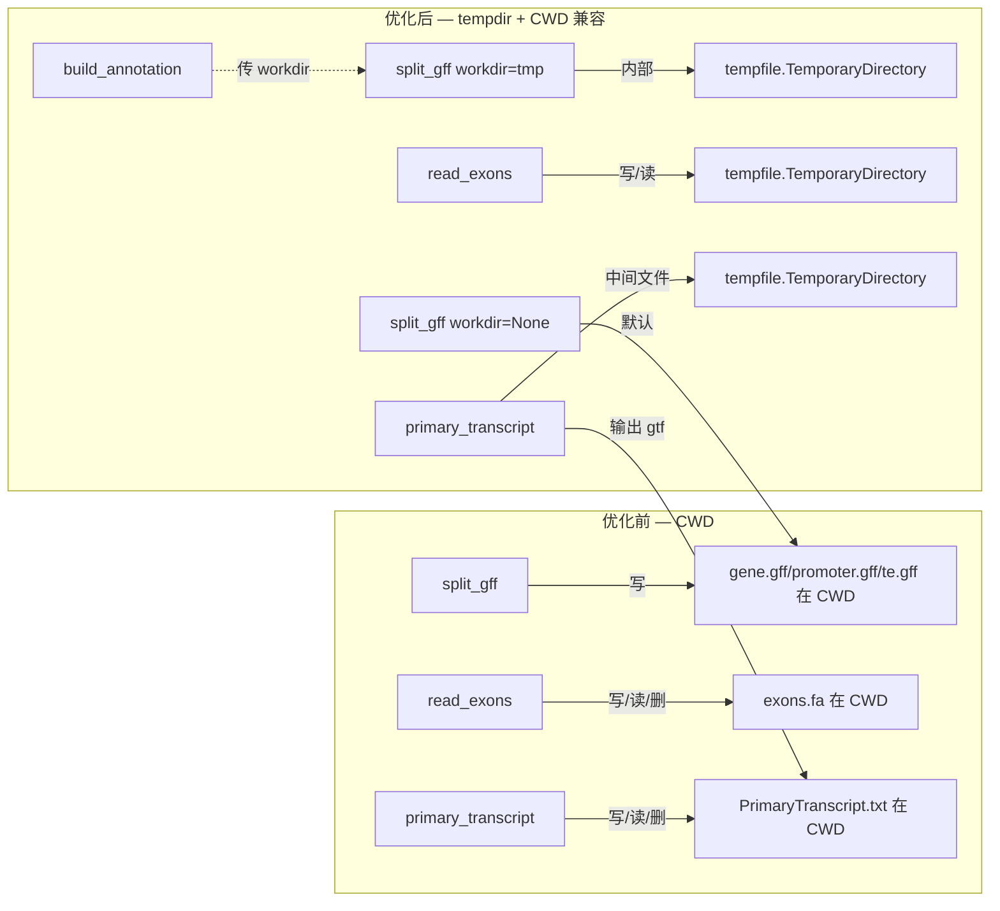

## 优化目标

对 `prnaseqtools/reference.py` 进行缺陷修复和代码优化，不改变所有 7 个外部 API 的函数签名。

## 修复内容

- **P0**: 将 6 处 `__import__('re')` 内联导入替换为顶部 `import re`，消除每次函数调用时的动态导入开销
- **P1**: 将 `read_exons()` 和 `primary_transcript()` 中写入 CWD 的中间临时文件迁移到 `tempfile` 管理，避免多进程并发冲突
- **P1**: `split_gff()` 新增可选 `workdir` 参数，`build_annotation()` 内部通过 temp dir 传递中间文件，外部调用 `srna.py` 保持 CWD 默认行为不受影响
- **P1**: 两处 `subprocess.run` 补充 `timeout=600`，防止 gffread/getPrimaryTranscript 无限挂起
- **P2**: 删除从未被调用的死代码：`_tee()`、`_prefix()`、`revcomp` 导入，以及因此不再需要的 `sys`/`Path` 导入
- **P2**: `read_exons()` 异常安全增强：通过 `finally` 块确保临时文件清理，避免 gffread 失败后 `os.unlink` 因文件不存在而二次崩溃

## 技术方案

### 整体策略

仅修改 `prnaseqtools/reference.py` 一个文件，所有变更保持外部 API 签名 `(prefix, genome, ...)` 不变。修改按优先级分层实施。

### 临时文件方案

**关键设计决策**：

- `split_gff` 保持默认 CWD 行为（`workdir=None`），外部 `srna.py` 无需改动
- `build_annotation` 内部创建 `TemporaryDirectory` 并传参，上下文退出时自动清理
- `read_exons` 的 `exons.fa` 是纯中间产物，完全移入 temp dir 并 `finally` 确保清理
- `primary_transcript` 的 `.txt` 中间文件移入 temp dir，`.gtf` 输出文件保留 CWD
- `get_gene_info` 的 `transcripts.fa` 是输出产物（可能被下游使用），保持 CWD 不变

### 实现细节

| 函数 | 变更点 |
| --- | --- |
| 顶部 import | `+import re, tempfile` / `-import sys, from Path, from revcomp` |
| `_tee()` `_prefix()` | 删除 (行 16-28) |
| `read_gff` | `__import__('re')` → `re` |
| `read_exons` | `TemporaryDirectory` 管理 exons.fa；finally 确保清理；+timeout=600 |
| `get_gene_info` | 无签名变更（transcripts.fa 保留 CWD） |
| `split_gff` | +可选参数 `workdir=None`，默认 CWD 向后兼容 |
| `build_annotation` | 创建 `TemporaryDirectory`，传给 `split_gff(..., workdir=tmp)` |
| `primary_transcript` | txt 中间文件移入 temp dir；+timeout=600 |
| `read_gene_annotation` | `__import__('re')` → `re` |
| `read_fasta` `read_chromosome_lengths` `read_mirna_gff` | 无变更 |

### 风险控制

- `split_gff` 默认 `workdir=None` 走原 CWD 路径，零回归风险
- `read_exons` 用 `try/finally` 包裹，gffread 失败不再导致二次崩溃
- 所有临时文件在 `with`/`finally` 块内自动清理，无泄漏
- `read_gff` 和 `read_gene_annotation` 虽无外部调用，保留不删（与 Perl 版本功能对齐）