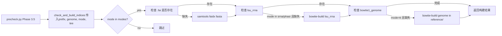

## 用户需求

1. 检查并修复 `prnaseqtools/reference.py` 中存在的 bug
2. 新增功能：当缺少必要的 mapping index（bowtie1/bowtie2/samtools faidx/lsu_rrna）时自动生成

## 核心功能

- **Bug 修复**：修复 `get_gene_info()` 的 CWD 临时文件问题、参考文件缺失时的错误提示、`.fai` 索引的自动生成
- **索引自动构建**：在 `reference.py` 中新增 `check_and_build_indices(prefix, genome, mode)` 函数，按分析模式自动检测并构建缺失索引
- **precheck 集成**：在 `precheck.py` 中新增 Phase，在分析开始前自动确保所有必需索引就绪
- **冗余清理**：移除 `cips.py` 和 `ribo.py` 中各自重复的 `samtools faidx` 逻辑

## 技术栈

- Python 3 (subprocess+shutil)
- 外部工具：bowtie-build, bowtie2-build, bismark_genome_preparation, samtools, STAR

## 实现方案

### 整体策略

采用"集中检测 + 按需构建 + 分级存放"架构：

1. **`reference.py`** 新增 `check_and_build_indices()` 作为统一入口，接收 `mode` 参数按需构建
2. 轻量索引（`.fai`, `lsu_rrna`）构建在 `reference/` 目录，被所有模式共享
3. 重量索引（Bowtie1 基因组、Bowtie2、Bismark、STAR）保持在 CWD 构建，与现有各 mode 执行流程兼容
4. **`precheck.py`** Phase 3 后新增 `check_and_build_indices()` 调用
5. 移除 `cips.py:77-79` 和 `ribo.py:539-541` 中的冗余 faidx 逻辑

### 索引存放策略

| 索引类型 | 存放位置 | 理由 |
| --- | --- | --- |
| `{genome}_chr_all.fasta.fai` | `reference/` | 轻量（KB级），被 `read_chromosome_lengths`/samtools 广泛依赖 |
| `lsu_rrna.*.ebwt` | `reference/` | 轻量，被 srna/phasi 多模式共享 |
| `{genome}_chr_all.*.ebwt` (Bowtie1) | `reference/` | 被 tt 模式使用，预存在可避免 10+ 分钟构建 |
| `{genome}_chr_all.*.bt2` (Bowtie2) | CWD | 数 GB，chip/atac 在 CWD 构建以避免污染 reference 目录 |
| Bismark index | CWD | wgbs 模式专属，需 symlink 操作 |
| STAR Genome/ | CWD | 最大（5-30GB），各模式构建参数不同（genomeSAindexNbases） |


### 新函数设计

```python
# reference.py 新增

INDEX_BUILDERS = {
    'fai': {
        'build_cmd': 'samtools faidx {fasta}',
        'check_file': '{fasta}.fai',
        'modes': None,  # all modes
        'location': 'reference',
    },
    'lsu_rrna': {
        'build_cmd': 'bowtie-build -q {rrna_fasta} lsu_rrna',
        'check_file': 'lsu_rrna.1.ebwt',
        'modes': ['srna', 'phasi'],
        'location': 'reference',
    },
    'bowtie1_genome': {
        'build_cmd': 'bowtie-build -q {prefix}/reference/{genome}_chr_all.fasta {genome}_chr_all',
        'check_file': '{genome}_chr_all.1.ebwt',
        'modes': ['tt'],
        'location': 'reference',
    },
}

def check_and_build_indices(prefix, genome, mode, tee=None):
    """Check and auto-build missing mapping indices for the given mode.
    Returns dict: {index_name: built (bool)}"""
```

### 数据流



### 性能考量

- 所有构建命令均通过 `subprocess.run(..., timeout=3600)` 执行，防止无限挂起
- 索引检查为 O(1) 文件存在性判断，无性能瓶颈
- `.fai` 索引构建通常 1-5 秒，bowtie-build 基因组索引 5-20 分钟（取决于基因组大小）
- 已存在的索引直接跳过，零额外开销

### 向后兼容

- `chip.py`、`atac.py`、`wgbs.py` 等 mode 文件**不做修改**，保持原有 CWD 构建逻辑
- `cips.py:77-79` 和 `ribo.py:539-541` 移除 faidx，由 reference.py 集中处理
- `srna.py` 中 mask/spikein 的 `bowtie-build` 保留不变（运行时临时数据）
- `precheck.py` 原 Phase 3 代码不变，新增 Phase 3.5

## 目录结构

```
prnaseqtools/
├── reference.py          # [MODIFY] 新增 check_and_build_indices() + INDEX_BUILDERS；修复 get_gene_info CWD 问题；read_fasta/read_mirna_gff/read_chromosome_lengths 增加友好错误提示
├── precheck.py           # [MODIFY] Phase 3 后新增 Phase 3.5 调用 check_and_build_indices()
├── modes/
│   ├── cips.py           # [MODIFY] 移除行 77-79 的重复 samtools faidx 逻辑
│   └── ribo.py           # [MODIFY] 移除行 539-541 的重复 samtools faidx 逻辑
└── reference/            # [RUNTIME] .fai 和 lsu_rrna 索引的存放目录（构建产物）
```